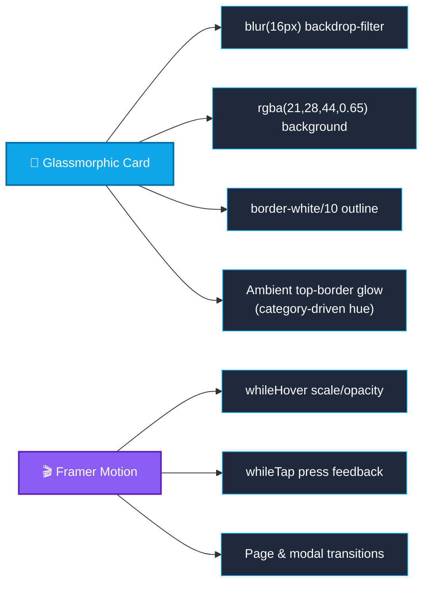
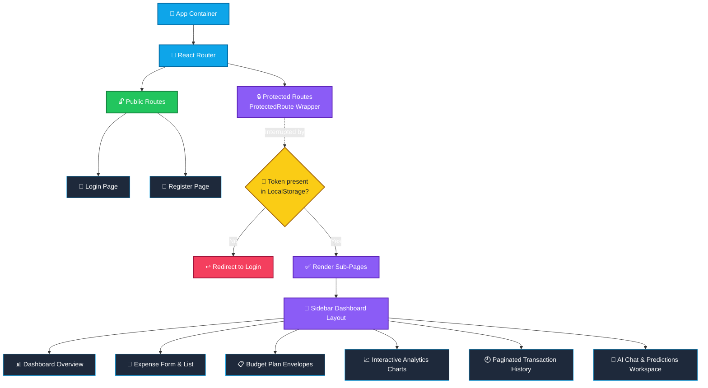
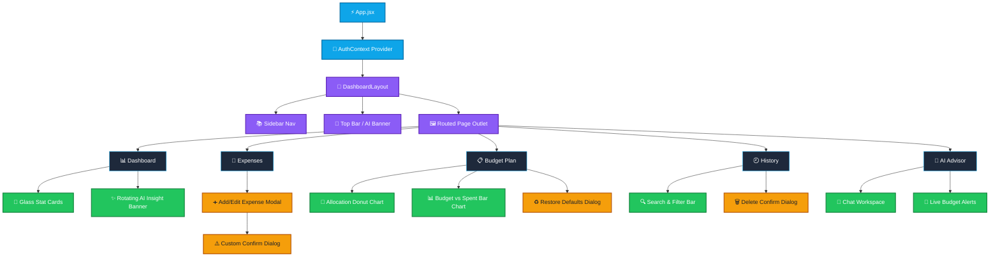
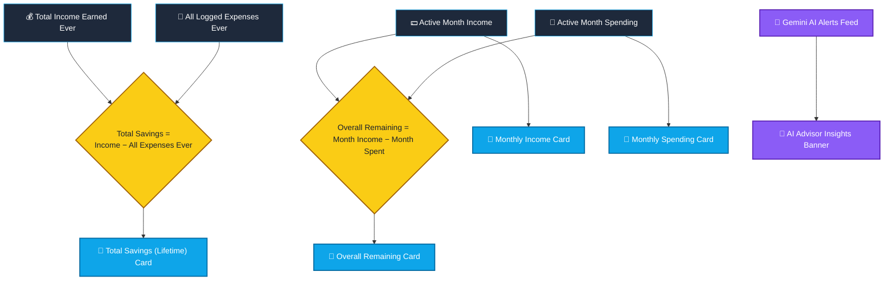
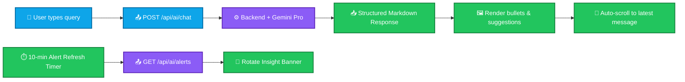
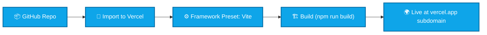

<div align="center">


<a href="https://vitejs.dev/"></a>
<a href="https://react.dev/"></a>
<a href="https://tailwindcss.com/"></a>
<a href="https://personal-expence-tracker-frontend.vercel.app/"></a>


</div>

> ⚠️ **Note on rendering:** the banner and typing-text above are real animated SVGs from two external, community-run services (`capsule-render`, `readme-typing-svg`), not a GitHub-native feature — worth a quick check after committing in case either service is briefly unavailable. Every diagram below is standard GitHub-native **Mermaid**, deliberately built with explicit per-node colors rather than raw theme overrides, since GitHub's dark/light mode auto-adapts default Mermaid colors but does **not** reliably respect custom theme injection — explicit `classDef` styling is what actually stays legible in both modes.

Welcome to **ExpenseFlow**, a premium, state-of-the-art personal budgeting and financial tracking application. The interface features glassmorphic cards, ambient neon glows, responsive layouts, and interactive visual charts. The app includes real-time AI budget forecasting and a custom financial advisor chat interface.

---

## 📚 Table of Contents

- [Design Aesthetics & UI System](#-design-aesthetics--ui-system)
- [Component Routing & Authentication Flow](#️-component-routing--authentication-flow)
- [App Component Architecture](#-app-component-architecture)
- [User Onboarding Journey](#-user-onboarding-journey)
- [Step-by-Step User Tutorial](#-step-by-step-user-tutorial--walkthrough)
- [Dashboard Financial Calculation Flow](#-dashboard-financial-calculation-flow)
- [AI Advisor Interaction Flow](#-ai-advisor-interaction-flow)
- [Technology Stack](#️-technology-stack)
- [Local Development Setup](#-local-development-setup)
- [Deployment on Vercel](#️-deployment-on-vercel)

---

## 🎨 Design Aesthetics & UI System

The application is styled with a custom dark-mode theme designed to prioritize visual excellence:
* **Ambient Glows**: Soft top-right blur gradients and colored top borders that glow dynamically based on card category rules.
* **Glassmorphic Panels**: Cards use `backdrop-filter: blur(16px)` with transparent dark backgrounds (`rgba(21, 28, 44, 0.65)`) and subtle white borders (`border-white/10`).
* **Tactile Interactions**: Micro-animations using **Framer Motion** (`whileHover`, `whileTap`) and custom transitions for premium touch controls.
* **Clean Forms**: Custom styles hide ugly browser default scrollbars and native white number input spin-buttons globally, ensuring a clean dark-mode input grid.



---

## 🗺️ Component Routing & Authentication Flow

The frontend handles navigation, page state transitions, and security checks using `react-router-dom`:



---

## 🧱 App Component Architecture



---

## 🧭 User Onboarding Journey

```mermaid
flowchart LR
    S1["1️⃣ Register / Sign In"] --> S2["2️⃣ Set Monthly Income"]
    S2 --> S3["3️⃣ Restore Default<br/>Budget Categories"]
    S3 --> S4["4️⃣ Explore Allocation<br/>Donut & Bar Charts"]
    S4 --> S5["5️⃣ Log Expenses"]
    S5 --> S6["6️⃣ Review Dashboard<br/>Overview Cards"]
    S6 --> S7["7️⃣ Browse & Manage<br/>Transaction History"]
    S7 --> S8["8️⃣ Consult the<br/>AI Financial Advisor"]

    classDef step fill:#0ea5e9,stroke:#0369a1,color:#fff,stroke-width:2px
    class S1,S2,S3,S4,S5,S6,S7,S8 step
```



---

## 📖 Step-by-Step User Tutorial & Walkthrough

Here is a step-by-step guide to get started with **ExpenseFlow**:

### 👤 Step 1: Registration and Signing In
1. Open the application landing page.
2. If you do not have an account, click the **"Register"** tab. Fill in your chosen Username, Email, and Password, then click **Register**.
3. Upon registration, you will be redirected to the **Sign In** screen.
4. Input your username (or email) and password, and click **Login** to enter the Dashboard.

---

### 💵 Step 2: Set Your Monthly Salary/Income
Before loging expenses, you must configure your income for the current month:
1. Navigate to the **"Budget Plan"** page from the sidebar menu.
2. In the **Monthly Salary Input** card, click **"Change"** (or input directly if it is empty).
3. Input your positive monthly income (e.g. `47,000.00`) and click the checkmark button or press enter.
4. Your total income, allocation capacities, and remaining surpluses will dynamically adjust.

---

### 📋 Step 3: Populate Predefined Budget Categories
Your dashboard starts fresh with `0%` allocations. You can populate it instantly with our default budget setup:
1. On the **"Budget Plan"** page, look at the **"Monthly Category Envelopes"** card header.
2. Click **"Restore Defaults"** at the top right.
3. Instead of an ugly native browser popup, a custom dark warning dialog will slide into view:

> [!WARNING]
> **Restore Default Categories?**
> This will delete all custom categories and restore the default 10 seeded category plan. Continue?

4. Click **Confirm** inside the modal.
5. All 10 categories will be populated:
   * **Rent** (22%)
   * **Groceries** (13%)
   * **Electricity + Wi-Fi** (3%)
   * **Term Insurance** (2%)
   * **SIP Investment** (18%)
   * **Gold Saving** (4%)
   * **Parents Support** (17%)
   * **FD/Emergency** (4%)
   * **Travel & Commute** (7%)
   * **Other Expenses** (10%)

---

### 📊 Step 4: Explore the Budget Allocation Charts
1. On the **"Budget Plan"** page, two responsive graphics dynamically display your settings:
   * **Target Allocation Percentages (Donut Chart)**: Shows how your income is divided. Hovering over a donut segment displays the **Category Name** and **Percentage** (e.g. `Rent: 22%`) via a custom dark tooltip. Below the chart, a custom flex-wrapping HTML legend renders the categories.
   * **Allocated Budget vs Actual Spent (Bar Chart)**: Compares your set budgets (blue) against your actual spending (red) for each category.
2. The card height expands dynamically to fit all your categories and legends without cropping.

---

### ➕ Step 5: Adding and Logging Expenses
1. Click the glowing blue **"+ Add Expense"** button at the top of the sidebar.
2. In the modal form, input:
   * **Title**: E.g. *"Hostel Rent"* or *"weekly grocery run"*
   * **Amount**: E.g. `4500.00`
   * **Category**: Select the target category from your configured list (e.g. *Rent*).
   * **Expense Date**: Choose the date of transaction.
   * **Notes**: (Optional) Additional notes.
3. Click **Add Expense**.
4. The transaction is instantly recorded, and your overall spent cards, remaining surpluses, and charts will recalculate.

---

### 📈 Step 6: Reviewing Your Dashboard Overview Cards
Navigate to the **"Dashboard"** to view your financial cards:
* **Monthly Income**: Your active salary.
* **Monthly Spending**: The sum of all expenses in the active month.
* **Overall Remaining**: Current monthly cash leftover (Income - Monthly Spent).
* **Total Savings (Lifetime)**: Your total lifetime saved money, calculated dynamically:
  $$\text{Total Savings} = (\text{Total Income Earned Ever}) - (\text{All Logged Expenses Ever})$$
* **AI Advisor Insights**: A rotating banner showing predictions and alerts about your spending, updated live from Gemini.

---

### 🔍 Step 7: Managing History and custom confirm warning modals
1. Navigate to the **"History"** page to view your complete paginated transaction log.
2. You can search by transaction name or filter by category and custom date ranges.
3. If you want to delete a transaction, click the red **trash bin icon** on the right side of the transaction row.
4. A custom warning modal will appear on screen:

> [!CAUTION]
> **Delete Transaction?**
> Are you sure you want to delete this expense record? This action cannot be undone.

5. Click **Confirm** to complete the deletion. Your monthly reports and lifetime savings balance will recalculate.

---

### 🤖 Step 8: Consult the AI Financial Advisor
1. Navigate to the **"AI Advisor"** workspace.
2. **Rotating Budget Advisor Banner**: Displays real-time spending warnings and congratulations using plain, simple English (avoiding jargon like "velocity" or "amortization").
3. **Chat Workspace**: Type your custom queries (e.g., *"How can I save more on my utilities this month?"* or *"Analyze my budget"*).
4. Gemini will respond with structured markdown, bullet points, and encouraging suggestions.
5. The chat box scroll adjusts automatically to keep the latest messages in view without shifting page headers.

---

## 🧮 Dashboard Financial Calculation Flow



---

## 💬 AI Advisor Interaction Flow



---

## 🛠️ Technology Stack

| Layer | Technology |
| :--- | :--- |
| ⚡ Build Tool | Vite v5 |
| ⚛️ UI Library | React v18 |
| 🎨 Styling | Tailwind CSS v3 (custom gradients, layers, and transition delays) |
| 🧷 Icons | Lucide React |
| 📊 Charts | Recharts (Pie, Donut, Bar, Cell, Tooltip, ResponsiveContainer) |
| 🎬 Animations | Framer Motion v11 |
| 🌐 API Client | Axios |

---

## 🚀 Local Development Setup

### Prerequisites
* **Node.js** (v18 or above recommended)
* **npm** (comes packaged with Node.js)
* **Git** CLI client

### Step 1: Clone the repository
```bash
git clone https://github.com/ashrithBalaji456/Personal_Expence_Tracker_Frontend.git
cd Personal_Expence_Tracker_Frontend
```

### Step 2: Install dependencies
```bash
npm install
```

### Step 3: Configure Environment Variables
Create a file named `.env` in the root folder of the project:
```env
VITE_API_BASE_URL=http://127.0.0.1:8080
```

Create a file named `.env.production` in the root folder of the project:
```env
VITE_API_BASE_URL=https://personal-expence-tracker-backend.onrender.com
```

* **Development mode (`npm run dev`)**: Connects to your local Spring Boot instance running at `127.0.0.1:8080`.
* **Production mode (`npm run build`)**: Vite bundles the production assets using the `.env.production` URL targeting the live Render API.

### Step 4: Run local dev server
```bash
npm run dev
```
Open your browser and navigate to `http://localhost:5173`.

---

## ☁️ Deployment on Vercel



The frontend is ready to deploy to **Vercel** with automatic production builds:

1. Create a free account at [Vercel](https://vercel.com).
2. Click **Add New** and select **Project**.
3. Import your GitHub repository `https://github.com/ashrithBalaji456/Personal_Expence_Tracker_Frontend`.
4. Ensure the **Framework Preset** is set to `Vite`.
5. Keep the build and output directories default.
6. Click **Deploy**. Vercel will automatically compile and host the app at a custom subdomain (e.g., `https://personal-expence-tracker-frontend.vercel.app/`).

---

<div align="center">

</div>
